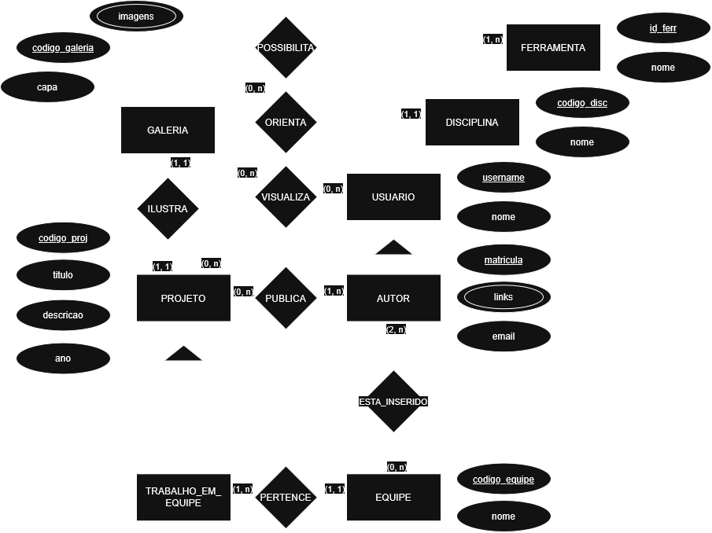

# ExpoDesignSQL
Um **banco de dados relacional** modelado durante a disciplina de **Fundamentos de Banco de Dados** na Universidade Federal do Ceará (UFC), utilizando o **PostgreSQL**.

## O que é o ExpoDesign?
O **ExpoDesign** é uma plataforma expositora de **trabalhos dos alunos da universidade**, trazendo visibilidade aos trabalhos dos alunos de Design Digital (DD) ao público geral, interno e externo. Desse modo, leva à população externa projetos que seriam promovidos apenas internamente na universidade, assim, aumentando o potencial de divulgação do talento dos alunos de Design Digital da Universidade Federal do Ceará (UFC).

## Diagrama Entidade-Relacionamento (DER)

## Notação Textual do Modelo Relacional (3FN)

    ● GALERIA(codigo_galeria [PK], url_capa [FK], codigo_proj [FK UNIQUE])
    ● IMAGEM(id_img[PK], url_imagem)
      ○ IMAGEM_GALERIA(id_img [PK, FK], codigo_galeria [FK])
    ● FERRAMENTA(id_ferr [PK], nome_ferr)
    ● PROJETO(codigo_proj [PK], titulo, descricao, ano, matricula[FK], codigo_disc[FK])
      ○ FERR_PROJ((id_ferr[FK], codigo_proj[FK]) [PK])
    ● TRABALHO_EM_EQUIPE((codigo_proj [FK], codigo_equipe [FK]) [PK])
    ● EQUIPE(codigo_equipe[PK], nome_equipe)
      ○ MEMBROS_EQUIPE((matricula [FK], codigo_equipe [FK]) [PK])
    ● AUTOR(matricula[PK], email, username [FK UNIQUE])
      ○ LINKS(id_link[PK], url_link, nome_link, matricula[FK])
    ● USUARIO(username[PK], nome_usuario)
    ● DISCIPLINA(codigo_disc[PK], nome_disc)
