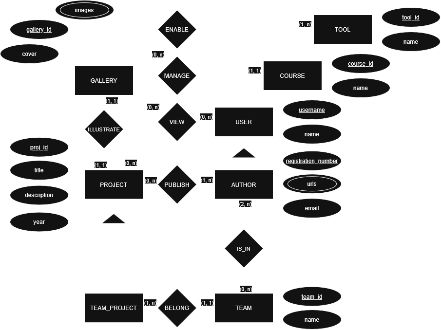

# 🖼️ ExpoDesignSQL
A **relational database** modeled during the **Database Fundamentals** course at the Federal University of Ceará (UFC), using **PostgreSQL**. \
🇧🇷 *There's also an available version of this [README in portuguese](README-PT.md)!*

## ❓ What is ExpoDesign?
**ExpoDesign** is a platform showcasing the **work of university students**, bringing visibility to the work of Digital Design (DD) students to the general public, both internal and external. In this way, it brings projects that would otherwise only be promoted internally to the wider population, thus increasing the potential for disseminating the talent of Digital Design students at the Federal University of Ceará (UFC).

### Main goals

- Increase the visibility of DD students' work among other university programs and beyond;
- Counteract distorted views of the program;
- Foster a community among campus designers;
- Encourage the production of design work for exhibition;
- Expand career opportunities for the program's talents;
- Create a relational database to support designers, their various projects, and those who will view them;
- Generate useful data queries;
- Create views and access controls using **PgAdmin**;
- Develop a simple **Python** application for data entry and manipulation.

## Entity-Relationship Diagram (ERD)

## Text Notation of the Relational Model (3NF)

    ● GALLERY(gallery_id [PK], cover_url [FK], proj_id [FK UNIQUE])
    ● IMAGE(img_id[PK], img_url)
      ○ IMAGE_GALLERY(img_id [PK, FK], gallery_id [FK])
    ● TOOL(tool_id [PK], tool_name)
    ● PROJECT(proj_id [PK], title, description, year, registration_number[FK], course_id[FK])
      ○ TOOL_PROJ((tool_id[FK], proj_id[FK]) [PK])
    ● TEAM_PROJECT((proj_id [FK], team_id [FK]) [PK])
    ● EQUIPE(team_id[PK], team_name)
      ○ TEAM_MEMBERS((registration_number [FK], team_id [FK]) [PK])
    ● AUTHOR(registration_number[PK], email, username [FK UNIQUE])
      ○ URLS(url_id[PK], url_link, url_name, registration_number[FK])
    ● USER(username[PK], user_fullname)
    ● COURSE(course_id[PK], course_name)
